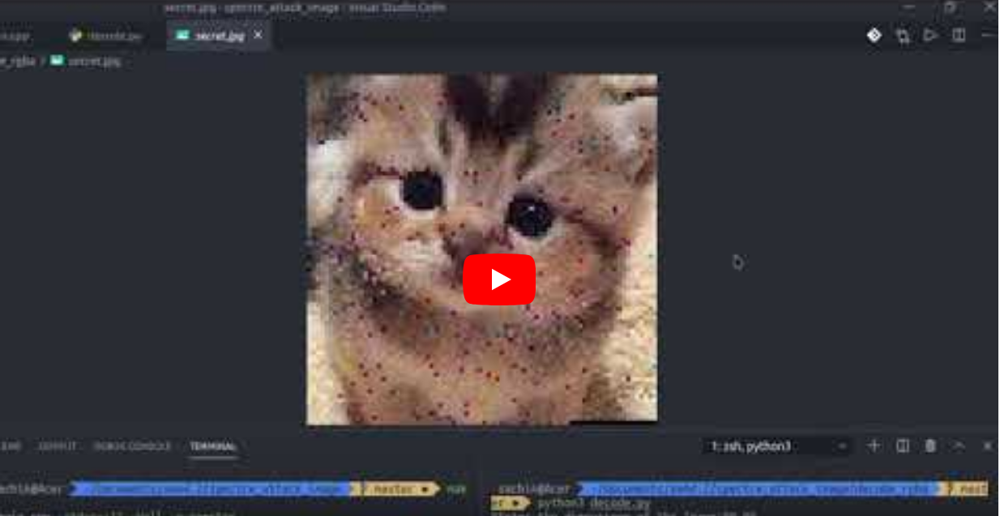

# SPECTRE ATTACK Variant 1 on Images

SPECTRE attack leverage the speculative Execution in modern processors. All the modern machines which use branch predictors are vulnerable to these attacks. Discovered by Google Zero team in 2017 and publicly announced in January 2018, Spectre and Meltdown mitigations has caused slowdown in the vulnerable machine.

**Checkout my Other Github Repo [here](https://github.com/yadav-sachin/spectre-attack)-- Spectre Variant 1 on string data, for Spectre theory and steps in detail.**.

Spectre attack is not a single security vulnerability, but a family of them. Here in this code, I have implemented the Conditional Branch variant, 'Variant 1' of Spectre attacks, which is to bypass the bounds check in the target program.

Here in this project, I have implemented to retrieve image buffer data in a program using SPECTRE attacks.

## File Structure

```shell
.
├── debugging
├── decode_base64   # decode base64 to image
│   ├── node_modules
│   ├── package.json
│   ├── package-lock.json
│   └── script.js
├── decode_rgb  # encode rgb buffer to image
│   └── decode.py
├── encode_base64 #encode image to base64
│   ├── node_modules
│   ├── package.json
│   ├── package-lock.json
│   └── script.js
├── encode_rgb  # encode image to rgb
│   └── encode.py
├── main.cpp    # the main spectre program
├── Makefile    
├── median_filter # apply median filter to remove hot pixels
│   └── median.py
└── README.md
```

## Running the Files
1. Encode the secret image that we have, example rgb
   ```shell
   $ cd encode_rgb
   $ python3 encode.py
   ```
   Input the image file details in the program.

2. Run spectre attack at project root dir
   ```shell
   $ make
   $ ./spectre
   ```
   The output is shown in 'spectre_output.txt'

3. Decode the spectre output
    ```shell
    $ cd decode_rgb
    $ python3 decode.py
    ```
    Input the necessary details in the program.

4. Apply Median filter on Resulting image to remove hot pixels
   ```shell
   $ cd median_filter
   $ python3 median.py
   ```

## Results
### Retrieving Image using spectre    
  [](https://youtu.be/tjav955c_vc)
### Original Image
      

### Spectre Output
     
   
### Output after Median filter radius = 5
      

## Resources for Spectre Attack

Check out these resources to learn more about Spectre attacks:

- Papers
  - [Spectre Attacks: Exploiting Speculative Execution](https://spectreattack.com/spectre.pdf)
- YouTube Videos
  - [Spectre and Meltdown: Data leaks during speculative execution | J. Horn (Google Project Zero)](https://youtu.be/6O8LTwVfTVs)
  - [Spectre Attacks Exploiting Speculative Execution -- IEEE Symposium](https://youtu.be/zOvBHxMjNls)
- Websites
  - [Meltdown and Spectre](https://spectreattack.com/)
